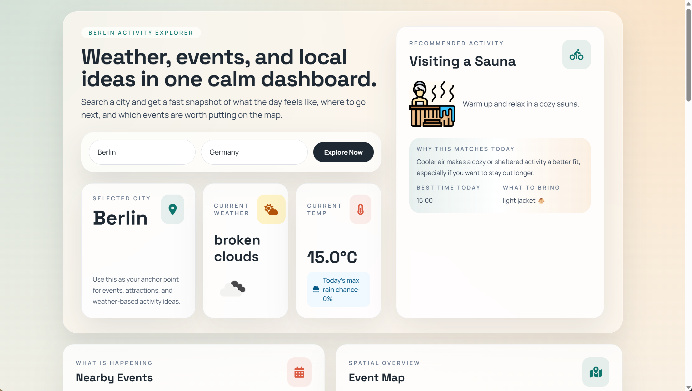
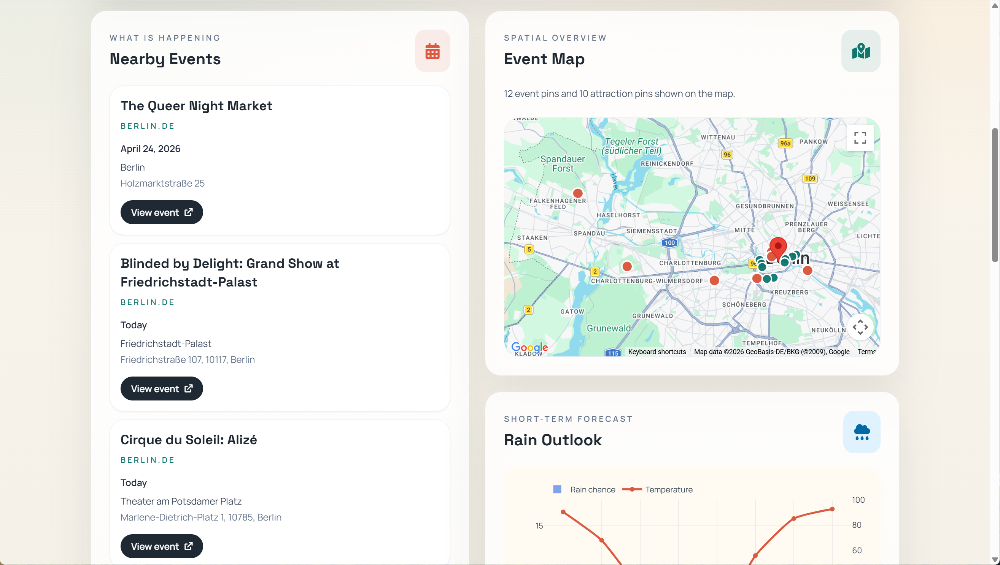
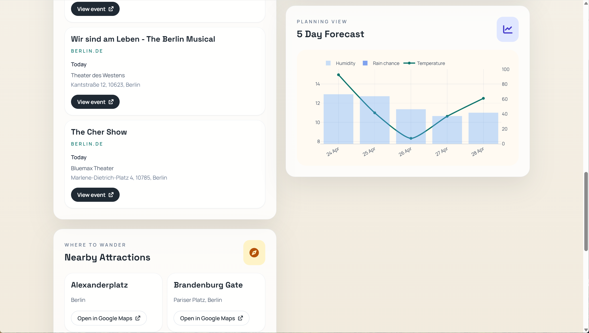

# Geo Activities App

Geo Activities App is a city discovery dashboard that combines weather, nearby attractions, and local event information in one view.

Users can search for a city and quickly explore:

- current weather and a 5-day forecast
- nearby tourist attractions
- local event suggestions
- an interactive map with events and attractions

This project was built as a portfolio app to practice full-stack thinking across UI, API integration, server-side proxying, rate limiting, and cost-aware feature design.

## Live Demo

[https://geo-activities-app.vercel.app/](https://geo-activities-app.vercel.app/)

## Screenshots

Hero and search experience



Events and map overview



Forecast and nearby attractions



## Features

- Search by city and country
- Current weather and 5-day forecast via OpenWeather
- City geocoding via OpenCage
- Nearby attractions via Google Places API (New)
- Interactive Google Map with event and attraction pins
- Berlin.de and selected Luma event aggregation
- Server-side API proxying to avoid exposing private keys
- Basic rate limiting and input validation on public API routes
- Manual "Search this area" map interaction to reduce unnecessary Places API requests

## Tech Stack

- Frontend: HTML, Tailwind CSS (CDN), vanilla JavaScript, Plotly
- Backend: Node.js, Express
- Server-side integrations: OpenWeather, OpenCage, Google Places API (New)
- Scraping / parsing: Cheerio
- Deployment: Vercel-ready Express app

## What I Focused On

This project was not only about making the UI work. I also focused on practical implementation details that matter in real apps:

- separating client and server responsibilities
- protecting private API keys by moving sensitive requests to the server
- reducing third-party API usage with caching and controlled map search behavior
- adding basic rate limiting and request validation to public endpoints
- making the app resilient when some event sources fail

## Architecture Notes

- `public/index.html` handles the UI and user interactions
- `server.js` serves static files and implements the `/api/*` routes
- private API calls are made on the server
- browser-side Google Maps uses a separate browser key
- event data is aggregated from Berlin.de and optional Luma URLs

## Local Development

1. Install dependencies:

```bash
npm install
```

2. Copy the example environment file and fill in your keys:

```bash
cp .env.example .env
```

3. Start the app:

```bash
npm run dev
```

4. Open:

```txt
http://localhost:3000
```

## Required Environment Variables

```env
GOOGLE_MAPS_BROWSER_API_KEY=
GOOGLE_MAPS_MAP_ID=
GOOGLE_MAPS_API_KEY=
OPENCAGE_API_KEY=
OPENWEATHER_API_KEY=
LUMA_EVENT_URLS=
```

## Recommended Google API Setup

`GOOGLE_MAPS_BROWSER_API_KEY`

- Use for the browser map only
- Restrict by `Websites`
- Allow `http://localhost:3000/*`
- Allow your production domain, for example `https://your-app.vercel.app/*`
- Restrict API usage to `Maps JavaScript API`

`GOOGLE_MAPS_MAP_ID`

- Optional
- Can be used for Google Maps customization and newer marker features

`GOOGLE_MAPS_API_KEY`

- Use on the server only
- Do not expose it in the browser
- Restrict API usage to `Places API (New)`
- Depending on hosting, strict application restrictions may require additional infrastructure such as fixed outbound IPs

## Deploying to Vercel

This project is compatible with Vercel's Express support:

- `public/` is served as static assets
- `server.js` handles the `/api/*` routes

Set the same environment variables from `.env.example` in:

- Vercel Dashboard -> Project -> Settings -> Environment Variables

## Notes

- `express.static('public')` is used for local development
- On Vercel, static assets are served from `public/`
- Event scraping is currently focused on Berlin
- Tailwind is currently loaded via CDN, which is acceptable for a prototype / portfolio version but can be migrated later to a build-based setup

## Future Improvements

- Move Tailwind from CDN to a build setup
- Improve map marker implementation and remove remaining Google Maps warnings
- Add stronger distributed rate limiting for production-scale traffic
- Expand event support beyond Berlin
